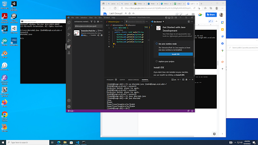
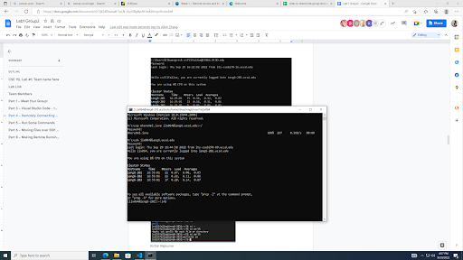
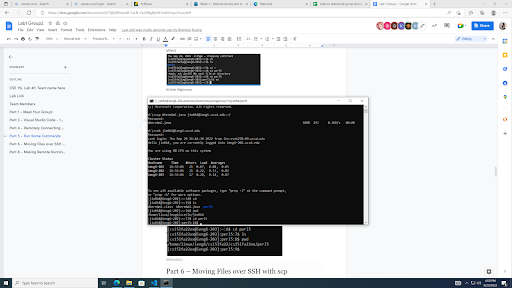
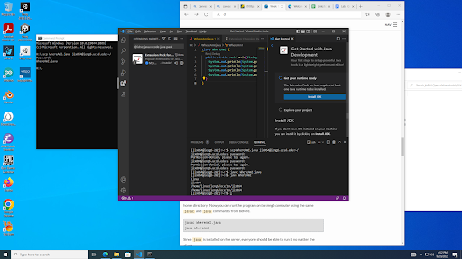
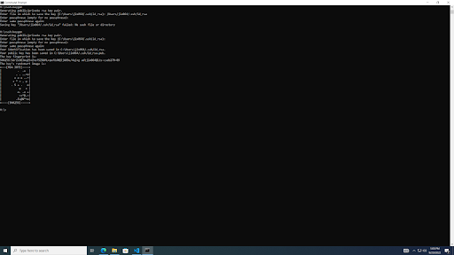
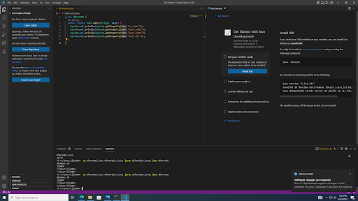

## Step 1 Installing VScode
- If you haven't installed VScode on your computer already, click on the link to download it: https://code.visualstudio.com/, follow instructions on the website.
- **Can't install on a tablet or chromebook.**  
 
## Step 2 Remotely Connecting
- Open a terminal in VSCode (ctrl or command + `, or simply click on Terminal tab). 
- **If on Windows**: install OpenSSH first in order to be able to connect with other computers. (ONLY INSTALL THE CLIENT, NOT THE SERVER!!!)
- Enter: "ssh yourusername@ieng6.ucsd.edu". 
- **If it's your first time connecting to the server, say yes when it asks you if you want to continue connecting.** 
- Enter your password when it asks you to do so, then you should be connected.  

## Step 3 Trying Some Commands
- Try running some commands such as cd, ls, on your computer and remote computer to ensure you did the right thing. 
- **To log out your remote computer, enter exit or do ctrl-D.**  

## Step 4 Moving Files with scp
- In your VSCode, create a file called WhereAmI.java, and put in the following contents: 
**class WhereAmI {  
  public static void main (String[] args) {  
    System.out.println(System.getProperty("os.name"));  
    System.out.println(System.getProperty("user.name"));  
    System.out.println(System.getProperty("user.home"));  
    System.out.println(System.getProperty("user.dir"));  
  }  
}**
- In your terminal, first enter: "javac Where AmI.java", and then enter: "java WhereAmI", to ensure they are working. 
- In the terminal in the directory that has this file, enter: "scp WhereAmI.java yourusername@ieng6.ucsd.edu:~/". 
- Log into your remote account again, use ls to check if files are copied successfully, and use the javac and java commands above to run the program.    

## Step 5 Setting an SSH Key
- In your terminal, enter “ssh-keygen”. When it asks you to enter file in which to save the key, just press enter. 
- For the passphrase, enter nothing. 
- Then, enter "ssh yourusername@ieng6.ucsd.edu", enter your password to log in.
- After logging in, enter "mkdir.ssh", then log out. 
- After loged out, enter "scp /Users/yourusernaame/.ssh/id_rsa.pub yourusername@ieng6.ucsd.edu:~/.ssh/authorized_keys". 
- **use your own username and path you saw in the command when generate the key.** 
- Now you should be able to log in without entering your password.  

## Step 6 Optimizing Remote Running
- Now try to run some commands at the end of an ssh command to run it on the remote server without logging in, then exit.
- You can also run multiple commands on the same line, just put semicolons in between. 
- You can also use up-key on your keyboard to run previous commands.  
 
**Enjoy the rest of 15L!**
