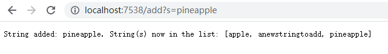

Code for My Search Engine:

    import java.io.IOException;
    import java.net.URI;
    import java.util.*;

    class Handler implements URLHandler {
        //Initiate arraylists to contain a list of strings. 
        ArrayList<String> ListofString = new ArrayList<String>();
        ArrayList<String> ListofSubString = new ArrayList<String>();

        public String handleRequest(URI url) {
            //Display Strings in the list. 
            if (url.getPath().equals("/")) {
                return String.format("String(s) already in the list: %s", ListofString.toString());
            } 
            else {
                System.out.println("Path: " + url.getPath());
                if (url.getPath().contains("/add")) {
                    String[] query = url.getQuery().split("=");
                    if (query[0].equals("s")) {   
                        ListofString.add(query[1]);
                        return  String.format("String that was added is: %s. String(s) now in the list: %s", query[1], ListofString.toString());
                    }
                }
                else if (url.getPath().contains("/search")){
                    String[] query = url.getQuery().split("="); 
                    if (query[0].equals("s")) {
                        for(String str:ListofString){   
                            if(str.contains(query[1])){
                                ListofSubString.add(str);
                            }
                        }
                        return  String.format("String(s) that contain(s) this substring: %s ", ListofSubString.toString());
                    }
                }
                return "404 Not Found!";
            }
        }
    }

    class SearchEngine {
        public static void main(String[] args) throws IOException {
            if(args.length == 0){
                System.out.println("Missing port number! Try any number between 1024 to 49151");
                return;
            }
            int port = Integer.parseInt(args[0]);
            Server.start(port, new Handler());
        }
    }

My Screenshots:  
 
Method called: handleRequest  
Values of relevant arguments: url=localhost:7575 
Values of relevant fields of the class: ListofString=[empty] 
How values change:  for this page, the value never changed.  
 
Method called: handleRequest 
Values of relevant arguments: url=localhost:7575/add?s=apple 
Values of relevant fields of the class: ListofString=[anewstringtoadd, pineapple, apple] 
 
Method called: handleRequest 
Values of relevant arguments: url=localhost:7575/search?s=app 
Values of relevant fields of the class: ListofString=[anewstringtoadd, pineapple, apple]; ListofSubString=[pineapple, apple] 
How values change: The string list now contain [anewstringtoadd, pineapple, apple]. After entering "/search?s=app", the else if statement is activated, and the for loop inside is also activated. The for loop goes through every single string inside the list, and look for the string that contains the substring at query[1], which is app in this case. If str.contain(query[1]) = true, then the string contains that substring is added to the ListofSubString by the ListofSubString.add(str) statement. Therefore, since both pineapple and apple contain "app", they are added to the ListofSubString, and returned and shown by the ListofSubString.toString() statement. 