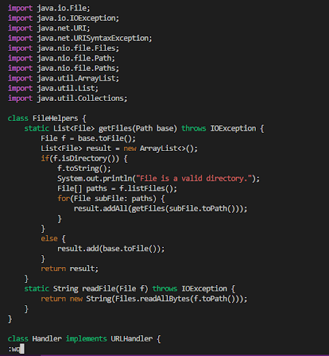

## Part 1
## Changing the name of the start parameter and its uses  to base
```
/start (enter) i (delete) (delete) (delete) (delete) (delete) base (esc)
/start (enter) i (delete) (delete) (delete) (delete) (delete) base (esc) 
/start (enter) i (delete) (delete) (delete) (delete) (delete) base (esc) 
:wq! 
```
<Br>
1. enter vim, enter /start, then press enter to find first occurence of the word start.

2. enter insert mode, press delete five times to delete the word start.

3. enter the word base.

4. press esc to leave insert mode and go back to normal mode. 

5. repeat 1, find the second occurence of start.

6. repeat 2. 

7. repeat 3.  

8. repeat 4, and repeat 1 to find the last occurance of start. 

9. repeat 2.

10. repeat 3.

11. press esc to go back to normal mode, enter :wq to save and quit vim. 


## Part 2
Time:
<br>
1. 6 minutes 32 seconds
<br>
2. 3 minutes 26 seconds
<Br>
<Br>
Q1: I would prefer uising the second stype if I have to work on a program that I were running remotely. It is much faster [especially when you do not have a local ssh key]. 
<Br>
Q2: If the project/task is very long, I would probably prefer the first style. It takes longer time, but if you make mistakes, editing locally makes it easier to catch and fix the errors. If it is short and easy to debug, I would prefer the second style. 
<br>
