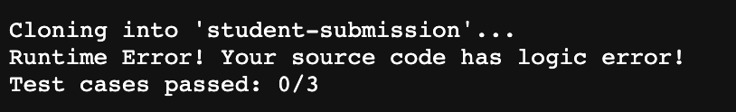
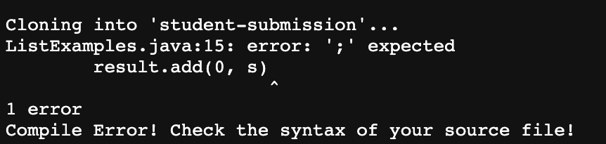

## Lab Report 5
[Partner: Kiyoshi]

Code for grade,sh:
~~~
CPATH="$PWD/student-submission:$PWD/lib/hamcrest-core-1.3.jar:$PWD/lib/junit-4.13.2.jar"

rm -rf student-submission
git clone $1 student-submission

if [[ ! -f "student-submission/ListExamples.java" ]]; then
	echo "ListExamples.java does not exists!"
	exit 1
fi

cp *.java "student-submission/"
cd student-submission

javac -cp $CPATH *.java

if [[ $? -ne "0" ]]; then
	echo "Compile Error! Check the syntax of your source file!"
	exit 1
fi

java -cp $CPATH org.junit.runner.JUnitCore TestListExamples &> result.txt

if [[ $? -ne "0" ]]; then
	echo "Runtime Error! Your source code has logic error!"
	TESTS=$(cat report.txt | grep -Po "\d+" | tail -n 2 | head -n 1)
	FAILURES=$(cat report.txt | grep -Po "\d+" | tail -n 2 | tail -n 1)
	SUCCESSES=$((TESTS - FAILURES))
	echo "Test cases passed: $SUCCESSES/$TESTS"
	exit 1
fi

echo "Success! All tests passed!"
~~~

Screenshot of the output: 
-list-methods-lab3.git

-list-methods-corrected.git

-list-methods-compile-error.git

Trace list-methods-lab3.git:  
1. 
Initialize a variable. No output nor exit code. 

2. 
    1. stdout: NA;
    2. stderr: NA;
    3. exit code: 0; 

3.
    1. stdout: Cloning into student-submission...
    2. stderr: NA; 
    3. exit code: 0;

4. 
    evaluate to false, since testExamples.java exists in the repository. 
5. 
    does not run since the if statement evaluate to false. 
6.
    does not run since the if statement evaluate to false. 
7.
    end of the if statement block. 
8. 
    1. stdout: NA;
    2. stderr: NA;
    3. exit code: 0; 

9. 
    1. stdout: NA;
    2. stdout: NA;
    3. exit code: 0;

10.
    1. stdout: NA;
    2. stderr: NA;
    3. exit code: 0; 

11. 
    evaluate to false since the exit code of the previous line is 0. 
12. 
    does not run since the if statement evaluate to false.
13. 
    does not run ssince the if statement evaluate to false. 
14.
    end of the if statement block. 
15.
    stdout: redirect to result.ext. 
~~~
JUnit version 4.13.2
.E.E.E
Time: 2.154
There were 3 failures:
1) testListFilterNormal(TestListExamples)
java.lang.AssertionError: expected:<[1, 2, 4, 5]> but was:<[5, 4, 2, 1]>
    at org.junit.Assert.fail(Assert.java:89)
    at org.junit.Assert.failNotEquals(Assert.java:835)
    at org.junit.Assert.assertEquals(Assert.java:120)
    at org.junit.Assert.assertEquals(Assert.java:146)
    at TestListExamples.testListFilterNormal(TestListExamples.java:16)
2) testListMerge(TestListExamples)
org.junit.runners.model.TestTimedOutException: test timed out after 2000 milliseconds
    at java.util.Arrays.copyOf(Arrays.java:3210)
    at java.util.Arrays.copyOf(Arrays.java:3181)
    at java.util.ArrayList.grow(ArrayList.java:267)
    at java.util.ArrayList.ensureExplicitCapacity(ArrayList.java:241)
    at java.util.ArrayList.ensureCapacityInternal(ArrayList.java:233)
    at java.util.ArrayList.add(ArrayList.java:464)
    at ListExamples.merge(ListExamples.java:42)
    at TestListExamples.testListMerge(TestListExamples.java:24)
3) testNoFilter(TestListExamples)
java.lang.AssertionError: expected:<[1, 2, 3, 4, 5]> but was:<[5, 4, 3, 2, 1]>
    at org.junit.Assert.fail(Assert.java:89)
    at org.junit.Assert.failNotEquals(Assert.java:835)
    at org.junit.Assert.assertEquals(Assert.java:120)
    at org.junit.Assert.assertEquals(Assert.java:146)
    at TestListExamples.testNoFilter(TestListExamples.java:10)

FAILURES!!!
Tests run: 3,  Failures: 3
~~~
    stderr: NA;
    exit code: 1;
16. 
    evaluate to true since the exit ccode of the previous command is 1. 
17.
    1. stdout: "Runtime Error! Your source code has logic error!"
    2. stderr: NA; 
    3. exit code: 0; 
18. 
    1. stdout: 3; 
    2. stderr: NA; 
    3. exit code: 0; 
19.
    1. stdout: 3; 
    2. stderr: NA; 
    3. exit code: 0; 
20. 
    1. stdout: 0; 
    2. stderr: NA; 
    3. exit code: 0; 
21. 
    1. stdout: “Test cases passed: 0/3”; 
    2. stderr: NA; 
    3. exit code: 0; 
22.
    1. stdout: NA; 
    2. stderr: NA; 
    3. exit code: 1; 
23.
    end of the if statement block. 
24. 
    not run since the bash script is already exited in 21. 